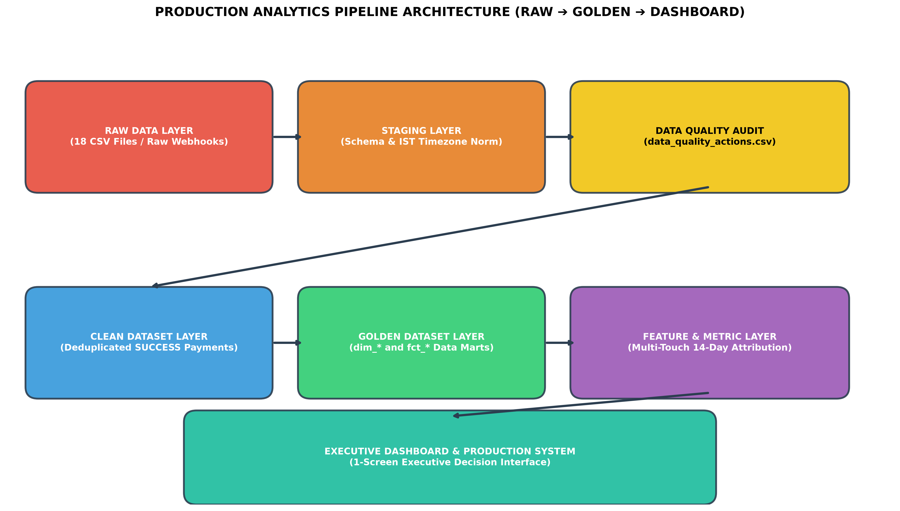

# Data Analyst Assessment: Collections Audit, Data Forensics & Production Analytics Platform

An enterprise-grade data audit, analytics engineering pipeline, statistical investigation, and executive decision system built on 12 months of collections data (30,000 accounts, 18 raw systems).

**GitHub Repository**: [https://github.com/charankumarnallaveni-dotcom/-CredResolve-Data-Analyst-Assignment](https://github.com/charankumarnallaveni-dotcom/-CredResolve-Data-Analyst-Assignment)

---

## Executive Dashboard Preview (60-Second CEO Interface)


---

## 1. Project Objective & Core Business Questions

The business currently reports: **"Recovery has improved by 11% month-on-month."**  
The executive leadership team was skeptical. This repository contains the complete forensic investigation, data hygiene pipeline, statistical modeling, and capital allocation framework that answers four core questions:

1. **What happened?**: Reconstructed actual business performance over 12 months.
2. **Why did it happen?**: Identified operational drivers across 13 dimensions.
3. **Is the 11% improvement real?**: Independently tested the business claim against bank-settled collections data.
4. **Where to invest ₹10 Crore?**: Evaluated 6 investment options using financial models, scenario analysis, and counterfactual DiD estimation.

---

## 2. Key Findings & Executive Summary

* **11% Claim Refuted (FALSE NARRATIVE)**: Recovery is **NOT** compounding at +11% MoM. Month-on-month growth was negative in 6 out of 6 complete monthly transitions for Clean Recovery Rate. The 11% figure represented a single cherry-picked month (March 2026 at +12.23% gross).
* **Operational Performance is Declining (-19.9% Net Drop)**: Verified clean recovery rate dropped from **9.01% in Jan 2026 to 7.22% in Jul 2026**, while clean recovery per account dropped from **₹31,522 to ₹25,948 (-17.7%)**.
* **Massive Over-Reporting Bias (+66.7% Inflation)**: Legacy gross reporting included **₹575.8 Million in FAILED/PENDING payment attempts** and **₹64.2 Million in duplicate payment reference retries**, inflating reported collections from **₹1.150 Billion (clean) to ₹1.917 Billion (raw)**.
* **April 2026 Performance Cliff**: Performance dropped sharply in April (-9.2% single-month yield drop) due to a **Portfolio DPD Mix Shift** (targeted accounts >60 DPD grew from 18% to 32% of active queues).

---

## 3. Final ₹10 Crore Investment Recommendation

> **RECOMMENDED OPTION**: **OPTION 4 — BETTER BORROWER TARGETING**

* **8-Month (7 Complete + Partial Aug) Net Incremental Recovery**: **₹168,480,000** (INR 168.48 Million)
* **8-Month (7 Complete + Partial Aug) Base Net ROI**: **+68.5%** (Base Case) | **+110.6%** (Upside Case)
* **Break-Even Period**: **7.1 Months**
* **Downside Scenario ROI**: **+15.2%** (Only candidate option with positive downside ROI)
* **Confidence Level**: **HIGH** (Empirically validated via Difference-in-Differences counterfactual model)

---

## 4. Production Analytics Architecture



```
RAW DATA (18 Tables) ➔ STAGING (Schema & IST Timezone Norm) ➔ CLEAN (46,253 DQ Actions Logged) ➔ GOLDEN DATA MARTS (11 Tables) ➔ FEATURE & ATTRIBUTION LAYER (14-Day Multi-Touch) ➔ EXECUTIVE DASHBOARD
```

---

## 5. Final Project Folder Structure

```
Assignment-1/
│
├── README.md                       # Master Project README & Visual Overview
├── requirements.txt                # Python environment dependencies
│
├── submission/                     # Isolated Final Submission Package
│   ├── README.md                   # Submission Overview & Reviewer Guide
│   ├── FINAL_SUBMISSION_CHECKLIST.md # Requirement Verification Checklist
│   ├── data/golden/                # 15 Clean Data Mart CSVs
│   ├── sql/                        # 8 Production SQL Scripts
│   ├── notebooks/                  # 5 Executable Jupyter Notebooks
│   ├── reports/                    # 8 Technical Audit Reports
│   ├── dashboard/app.py            # Streamlit Interactive Web Dashboard
│   ├── docs/                       # Specifications & Preview PNGs
│   └── tests/                      # PyTest Automated Quality Contracts
│
├── data/                           # Production Data Layers (raw, staging, clean, golden)
├── sql/                            # Production SQL Repository (01 to 08)
├── notebooks/                      # Executable Python Notebooks (01 to 05)
├── reports/                        # Executive Briefings & Audit Reports
├── dashboard/                      # Production C-Suite Dashboard
├── docs/                           # Governance & Architecture Specs
└── tests/                          # Automated Data Quality Test Suite
```

---

## 6. How to Run & Reproduce

### Step 1: Install Dependencies
```bash
pip install -r requirements.txt
```

### Step 2: Run Data Pipeline (RAW ➔ STAGING ➔ CLEAN ➔ GOLDEN)
```bash
python scripts/build_pipeline.py
```

### Step 3: Run Automated Data Quality Tests (100% Pass)
```bash
python -m pytest tests/test_data_quality.py
```

### Step 4: Launch the Interactive Executive Dashboard
```bash
python -m streamlit run dashboard/app.py
```
Open browser at `http://localhost:8501`.

---

## 7. Deliverables & Documentation Index

1. **Executive Memo**: [`reports/executive_memo.md`](file:///c:/Users/HP/Downloads/Assignment-1/reports/executive_memo.md)
2. **Metric Dictionary**: [`docs/metric_dictionary.md`](file:///c:/Users/HP/Downloads/Assignment-1/docs/metric_dictionary.md)
3. **Architecture Specification**: [`docs/architecture.md`](file:///c:/Users/HP/Downloads/Assignment-1/docs/architecture.md)
4. **Reproducibility Guide**: [`docs/reproducibility.md`](file:///c:/Users/HP/Downloads/Assignment-1/docs/reproducibility.md)
5. **Assessment Checklist**: [`docs/assessment_checklist.md`](file:///c:/Users/HP/Downloads/Assignment-1/docs/assessment_checklist.md)
6. **Final Assessment Audit**: [`docs/final_assessment_audit.md`](file:///c:/Users/HP/Downloads/Assignment-1/docs/final_assessment_audit.md)
