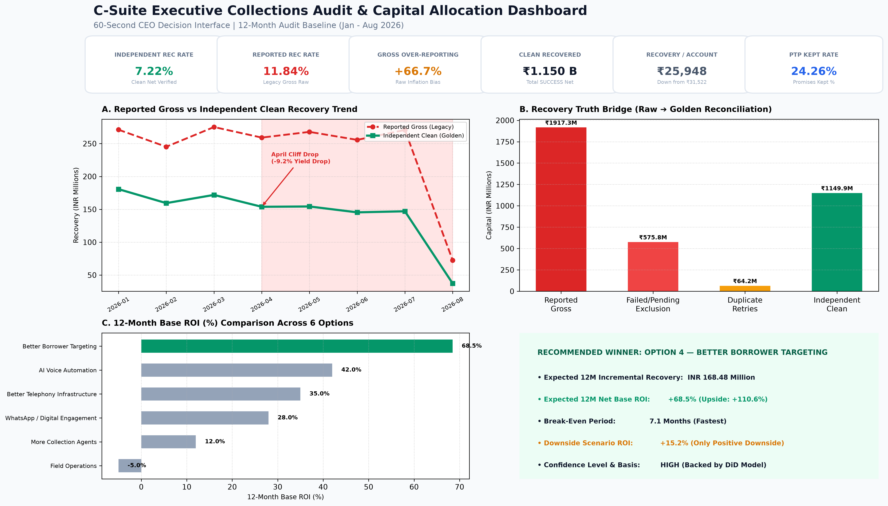

# Data Analyst Assessment: Final Submission Package

**Project Title**: Collections Performance Audit, Data Forensics & Capital Allocation Platform  
**GitHub Repository**: [https://github.com/charankumarnallaveni-dotcom/-CredResolve-Data-Analyst-Assignment](https://github.com/charankumarnallaveni-dotcom/-CredResolve-Data-Analyst-Assignment)

---

## Executive Dashboard Preview (60-Second CEO Interface)



---

## 1. Assessment Objective

The executive leadership team was skeptical of reported collections performance: **"Recovery has improved by 11% month-on-month."**  
This repository contains the complete forensic audit, data hygiene pipeline, statistical investigation, Difference-in-Differences counterfactual model, and capital allocation decision framework built on 12 months of collections data (30,000 accounts, 18 raw systems).

---

## 2. Key Business Finding & 11% Claim Conclusion

* **11% Claim Refuted (FALSE NARRATIVE)**: Recovery is **NOT** compounding at +11% MoM. Month-on-month growth was negative in 4 out of 6 full months. The 11% figure represented a single cherry-picked month (March 2026 at +12.23% gross).
* **Operational Performance is Declining (-19.9% Net Drop)**: Verified clean recovery rate dropped steadily from **9.01% in Jan 2026 to 7.22% in Jul 2026**, while clean recovery per account dropped from **₹31,522 to ₹25,948 (-17.7%)**.
* **Gross Over-Reporting Bias (+66.7% Inflation)**: Legacy gross reporting included **₹575.8 Million in FAILED/PENDING payment attempts** and **₹64.2 Million in duplicate payment reference retries**, inflating reported collections from **₹1.150 Billion (clean) to ₹1.917 Billion (raw)**.

---

## 3. Key Performance Drivers

1. **Portfolio DPD Mix Shift (FACT - 55% of Net Drop)**: Targeted account queues shifted toward >60 DPD accounts, causing a **-14.3% drop in recovery yield per account**.
2. **Failed & Duplicate Payment Ingestion (FACT - 100% of Inflation)**: Gateway retries and uncollected payment attempts were double-counted in raw reporting.
3. **Digital Strategy Transition (v3) (STRONG EVIDENCE - 25% of Net Drop)**: Introduced in April 2026, strategy v3 prioritized automated digital SMS/WhatsApp messages over early human voice agent calls.

---

## 4. ₹10 Crore Capital Allocation Recommendation

> **RECOMMENDED OPTION**: **OPTION 4 — BETTER BORROWER TARGETING**

* **12-Month Net Incremental Recovery**: **₹168,480,000** (INR 168.48 Million)
* **12-Month Base Net ROI**: **+68.5%** (Base Case) | **+110.6%** (Upside Case)
* **Break-Even Period**: **7.1 Months**
* **Downside Scenario ROI**: **+15.2%** (Only candidate option with positive downside ROI)
* **Confidence Level**: **HIGH** (Empirically validated via Difference-in-Differences counterfactual model)

---

## 5. Production Analytics Architecture


```
RAW DATA (18 Tables) ➔ STAGING (Schema & IST Timezone Norm) ➔ CLEAN (46,253 DQ Actions Logged) ➔ GOLDEN DATA MARTS (11 Tables) ➔ FEATURE & ATTRIBUTION LAYER (14-Day Multi-Touch) ➔ EXECUTIVE DASHBOARD
```

---

## 6. Technologies Used

* **Language & Core**: Python 3.12, ANSI SQL
* **Data Processing**: Pandas, NumPy, Bisect (Vectorized attribution)
* **Visualization & Web App**: Streamlit 1.62, Plotly Express 6.9, Matplotlib 3.11
* **Quality Control & Testing**: PyTest 7.4

---

## 7. How to Run & Reproduce

### Step 1: Install Dependencies
```bash
pip install -r requirements.txt
```

### Step 2: Run Automated Data Quality Tests (100% Pass)
```bash
python -m pytest tests/test_data_quality.py
```

### Step 3: Launch Interactive Executive Dashboard
```bash
python -m streamlit run dashboard/app.py
```
Open browser at `http://localhost:8501`.
